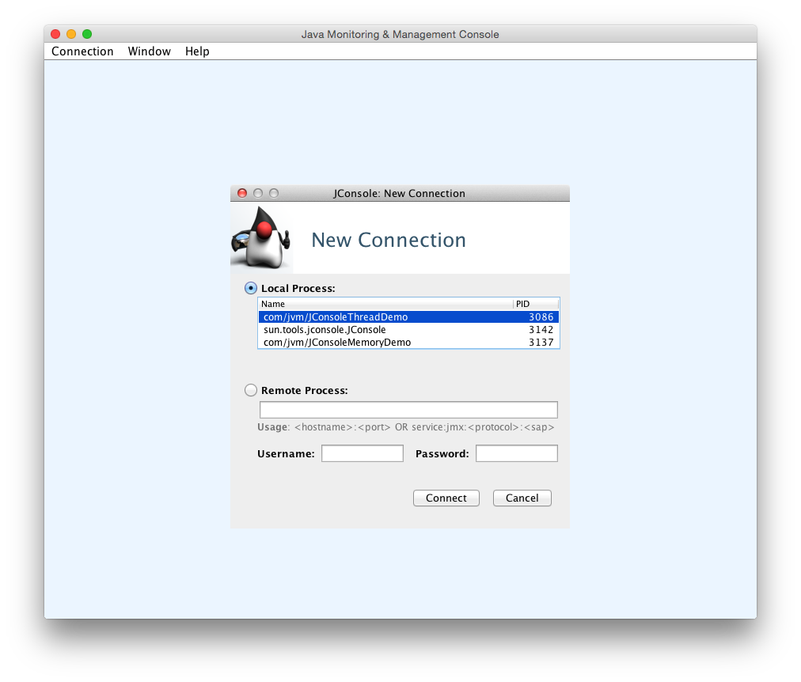

# JDK的可视化工具

JDK中除了提供大量的明命令行工具外，还提供了两个强大的可视化工具：JConsole 和 VisualVm。

其中 JConsole 是在 JDK1.5 时期就已经提供的虚拟机监控工具，而 VisualVM 在 JDK 1.6 Update7 中才首次发布。

## JConsole：Java监视与管理控制台

JConsole 是一种基于 JMX 的可视化监视、管理工具。

### 启动 JConsole

通过 JDK/bin 目录下的 jconsole.exe 启动 JConsole 后，将自动搜索出本机运行的所有虚拟机进程，不需要用户自己通过 jps 命令来查询。双击其中一个进程即可开始监控也可以使用下面的“远程进程”功能来连接远程服务器，对远程虚拟机进程监控。



JConsole 主界面一共有“概述”、“内存”、“线程”、“类”、“VM摘要”、“MBean”6个也签，如图所示：


“概述”页签显示的是整个虚拟机主要运行数据的概览，其中包括“堆内存使用情况”、“线程”、“类”、“CPU使用情况”4种信息的曲线图，这些曲线图后面是“内存”、“线程”、“类”页签的信息汇总，具体内容后面详细介绍。

### 内存监控

“内存”页签相当于可视化的 jstat 命令，用于监视受可视化参数管理的虚拟机内存（Java堆和永久代）的变化趋势。我们通过下面的代码来体验一下它的监视功能。运行时设置的虚拟机参数为：-Xms100m -Xmx100m -XX:+UseSerialGC，这块代码的作用是以 64KB/50毫秒 的速度往 Java 堆中填充数据，一共填充1000次，使用 JConsole 的“内存”页进行监视，观察曲线和柱状指示图的变化。

```bash
/**
 * 内存占位符对象，一个 OOMObject 大约占 64KB
 */
static class OOMObject{
    public byte[] placeholder = new byte[64 * 1024];
}
public static void fillHeap(int num) throws InterruptedException {
    List<OOMObject> list = new ArrayList<OOMObject>();
    for (int i = 0; i < num; i++) {
        //稍作延时，令监视曲线的变化更加明显
        Thread.sleep(50);
        list.add(new OOMObject());
    }
    System.gc();
}
public static void main(String args[])throws Exception {
    fillHeap(1000);
}
```


### 线程监控

## VisualVM：多合一故障处理工具


